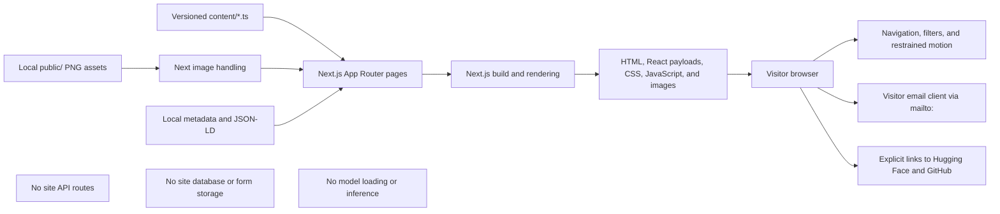

# Repository and research architecture

## Scope boundary

This repository is the public website for rappidAI research. It renders
editorial content and links to research artifacts. It does **not** contain the
training pipeline, model checkpoints, GGUF files, datasets, an inference
service, an application API, or a database.

Training and data-preparation code live in the separate public
[`lumen-quantum`](https://github.com/jonascikemgil07-hue/lumen-quantum)
repository. Released pilot weights live in separate Hugging Face repositories.
Keeping these boundaries explicit prevents website copy, a configuration file,
and an actual model artifact from being treated as equivalent evidence.

## Website runtime

The application uses the Next.js App Router. Route components read versioned
TypeScript content and local PNG assets. Most pages render as server components;
small client components provide navigation, filtering, motion, and contact-form
behavior. The contact form validates locally and opens the visitor's email
client with a `mailto:` URL. It does not submit to a site-owned API.

The site does not fetch model metadata at request time. Model facts are curated
in version-controlled content and documentation, so updating an external model
repository does not silently change the website. The trade-off is that a
maintainer must review and update the website when authoritative evidence
changes.

### Primary website modules

| Area           | Responsibility                                                      |
| -------------- | ------------------------------------------------------------------- |
| `app/`         | Routes, layouts, metadata, sitemap, robots rules, and global styles |
| `components/`  | Presentational and narrowly scoped interactive UI                   |
| `content/`     | Typed editorial content, model facts, links, and legal placeholders |
| `lib/`         | Shared metadata and safe JSON-LD serialization helpers              |
| `public/`      | Website-served raster brand and model-card images                   |
| `model_cards/` | Evidence-bounded model and research cards                           |
| `docs/`        | Architecture, provenance, training, maintenance, and audit records  |
| `tests/`       | Focused content-integrity and serialization tests                   |

### Trust boundaries

- **Maintainer-authored content:** values in `content/` are trusted application
  input but still require source review because the browser presents them as
  research facts.
- **Inline structured data:** JSON-LD is serialized with script-breaking
  characters escaped before insertion into the document.
- **Visitor input:** contact fields remain in the browser until the browser is
  directed to the visitor's email client; the website has no receiving API.
- **External destinations:** Hugging Face and GitHub are separate origins with
  separate availability, privacy, security, and licensing terms.
- **Static assets:** local delivery does not prove that an asset is licensed for
  redistribution; provenance is tracked separately.

## Research and artifact pipeline

The diagram below describes the intended evidence chain in the separate
research repository. A solid edge represents a stage for which public pilot
artifacts or Echelon preflight/smoke evidence exists. A dashed edge represents
planned Echelon work that has not been completed.

```mermaid
flowchart LR
  Source["FineWeb2-HQ deu_Latn source"] --> Prep["Streaming, cleaning, filtering, and deduplication"]
  Prep --> Split["Deterministic train / validation / test assignment"]
  Split --> TokCorpus["Tokenizer corpus"]
  TokCorpus --> Tokenizer["Versioned tokenizer and validation"]
  Split --> Packing["Tokenization and fixed-context packing"]
  Tokenizer --> Packing
  Packing --> Prepared["Prepared tensors or shards plus manifests"]
  Config["Versioned architecture and run configuration"] --> Train["Model training stage"]
  Prepared --> Train
  Train --> Checkpoints["Checkpoints and training logs"]
  Checkpoints --> Eval["Held-out and qualitative evaluation"]
  Eval --> Export["GGUF export, manifest, size, and SHA-256"]
  Export --> HF["Public Hugging Face release"]
  HF --> Site["Curated links and evidence-bounded website copy"]

  ESmoke["Echelon Garden smoke: 1,380,886 tokens"] -.->|"production run not started"| EProd["Echelon production shards: planned"]
  EProd -.->|"model training not started"| EBase["quantum-1-echelon-base weights: absent"]
  EBase -.->|"future stage, not specified"| EChat["quantum-1-echelon-chat: no artifact"]
```

### Evidence state by family

| Family / stage      | Prepared-data evidence                                                                                      | Training evidence                                                                 | Public model artifact                  |
| ------------------- | ----------------------------------------------------------------------------------------------------------- | --------------------------------------------------------------------------------- | -------------------------------------- |
| `quantum-1-pilot`   | Public configuration and a publisher-reported approximately 100M-token scope; no final public data manifest | Publisher reports a completed from-scratch run; no final public run manifest      | F16 GGUF, manifest, size, and checksum |
| `quantum-1.6-pilot` | Public configuration and a publisher-reported 500M additional tokens; no final public data manifest         | Publisher reports continued pretraining and metrics; no final public run manifest | F16 GGUF, manifest, size, and checksum |
| `quantum-1-echelon` | Tokenizer validation and a 1,380,886-token Garden smoke test                                                | Architecture preflight only; production data and model training not started       | None                                   |

## Publication flow for a research claim

Before a model fact enters `content/` or a model card:

1. identify the authoritative source and immutable revision;
2. classify the statement as verified metadata, publisher-reported result,
   configured target, or absent evidence;
3. link the claim to a manifest, report, configuration, or artifact checksum;
4. record limitations and what the evidence does not demonstrate;
5. review licensing separately for code, data, weights/tokenizers, and assets;
6. update automated content-integrity tests where the value is machine-checkable;
7. build and inspect the site; and
8. preserve the source revision in the release or pull-request record.

Use [the training-run template](training-run-template.md) for future model runs
and [the data and training record](data-and-training.md) for the current evidence
boundary.
